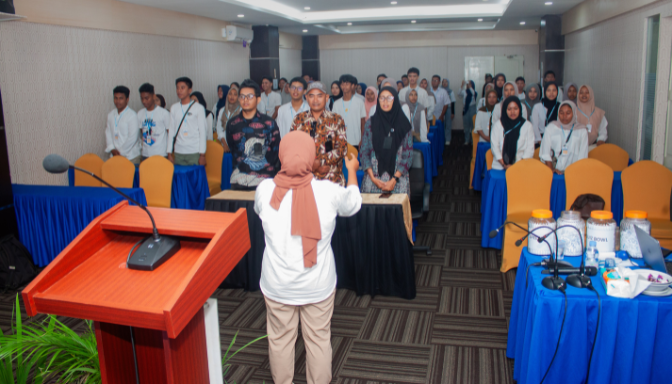

    <!-- <section id="visimisi" class="py-20 bg-white">
        

            

                
                

                    <h4 class="text-blue-500 text-xl font-bold mb-2">VISI</h4>
                    

                        Berketerampilan berbahasa asing dengan semangat timur Indonesia,
                        profesional dalam proses belajar mengajar serta manajemen lembaga,
                        berkompeten dan unggul dalam pendidikan sesuai standar internasional atau nasional.
                    

                

                
                

                    <h4 class="text-blue-500 text-xl font-bold mb-2">MISI</h4>
                    <ol
                        class="list-decimal ml-6 space-y-2 text-gray-600 text-sm leading-relaxed text-justify flex-grow">
                        <li>Mewujudkan lulusan yang cerdas dan kompetitif, serta membekali peserta didik pendidikan dan
                            keterampilan berbahasa asing dari tingkat dasar sampai mahir secara efektif.</li>
                        <li>Mengembangkan mutu kelembagaan dari aspek sistem manajemen, instruktur dan kurikulum serta
                            metode pengajaran yang profesional.</li>
                        <li>Menjalin kemitraan lokal, regional, nasional, dan internasional secara berkesinambungan.
                        </li>
                        <li>Berkontribusi dalam meningkatkan kualitas SDM maju serta membentuk generasi bangsa yang
                            kompeten
                            dan profesional.</li>
                    </ol>
                

            

        

    </section> -->

    <!-- KIMU Recap -->
    <!-- <section id="galeri" class="py-20 bg-gray-50">
        

            

                <h2 class="text-3xl md:text-4xl text-center font-bold mb-6">
                    GALERI
                     KIMU
                </h2>
            
 -->
    <!-- Carousel Container -->
    <!-- 
 -->
    <!-- Slides Container -->
    <!-- 
 -->
    <!-- Slide 1 -->
    <!-- 

                        
                        

                            <h3 class="text-2xl font-bold text-white">November Camp</h3>
                            
 📠Pulo Tareba

                        

                    
 -->

    <!-- Slide 2 -->
    <!-- 

                        
                        

                            <h3 class="text-2xl font-bold text-white">The English Voice of Gen Z</h3>
                            
 📠Muara Mall

                        

                    

                
 -->

    <!-- Navigation Arrows -->
    <!-- <button class="absolute top-1/2 left-4 transform -translate-y-1/2" id="prev-btn">
                    <svg xmlns="http://www.w3.org/2000/svg" fill="none" viewBox="0 0 24 24" stroke-width="1.5"
                        stroke="white" class="h-6 w-6">
                        <path stroke-linecap="round" stroke-linejoin="round" d="M15.75 19.5L8.25 12l7.5-7.5" />
                    </svg>
                </button>
                <button class="absolute top-1/2 right-4 transform -translate-y-1/2" id="next-btn">
                    <svg xmlns="http://www.w3.org/2000/svg" fill="none" viewBox="0 0 24 24" stroke-width="1.5"
                        stroke="white" class="h-6 w-6">
                        <path stroke-linecap="round" stroke-linejoin="round" d="M8.25 4.5l7.5 7.5-7.5 7.5" />
                    </svg>
                </button> -->

    <!-- Dots Navigation -->
    <!-- 
 -->
    <!-- Dots akan diisi oleh JavaScript -->
    <!-- 

            

    </section> -->

    <!-- Tentang Kami -->
    <!-- <section id="tentang_kami" class="py-20 bg-white">
        

            <h2 class="text-3xl md:text-4xl font-bold mb-6">
                TENTANG
                 KAMI
            </h2>
            

                

                    Kampung Inggris Maluku Utara berdiri sejak 2017, di rumah pribadi pendirinya dengan sebuah ruangan
                    sederhana yang dimanfaatkan untuk ruang belajar mengajar bahasa Inggris dan beralamat di Kel.
                    Kasturian dengan nama Desa Inggris Ternate dan mendapatkan 30 students pertama. Setahun setelahnya
                    tempat kursus ini berpindah domisili dan berkantor di Koloncucu Jl. Bola namun kelas kursusnya
                    beroperasi di kawasan tapak 2 pada masa itu dengan memanfaatkan ruangan pemilik UMKM. Pada tahun
                    2019, ruangan kelas tempat kursus berpindah ke salah satu rumah warga dan kantor posyandu yang di
                    jadikan kelas untuk belajar di malam hari yang mana di resmikan langsung oleh pak lurah dan juga pak
                    RT setempat.
                

                 
                

                    Namun, ketika di tahun 2020 dunia dilanda pandemi Covid, seluruh students harus belajar secara
                    daring dari rumah masing-masing dan segala aktivitas sedikit terhambat bahkan tidak melakukan
                    pelayanan di kantor hingga tahun 2021. Pada tahun 2022 wadah kami mulai berubah nama menjadi Kampung
                    Inggris Timur dan memberikan beasiswa kepada beberapa orang untuk belajar langsung di pusat lembaga
                    kursus di pare, Kediri, Jawa Timur. Setahun setelahnya di tahun 2023, Kampung Inggris berubah nama
                    menjadi Kampung Inggris Maluku Utara tepatnya pada bulan Oktober dan mulai aktif belajar kembali di
                    benteng Oranje dengan sedikit siswa, hingga pada akhirnya di tahun 2024 awal, Kampung Inggris Maluku
                    Utara dibawah naungan Yayasan Noble Future Education di berikan fasilitas kantor dan ruang belajar
                    oleh pemerintah Kota Ternate di benteng Oranje untuk di manfaatkan sebagai ruang belajar dan
                    pemanfaatan ruangan secara baik. Pada November 2024, Kampung Inggris telah membuat kegiatan besar
                    seperti November Camp (melatih mental dan potensi students) dan didanai oleh Bank Indonesia dan
                    beberapa sumbangsi individu dan juga The English Voice of Gen Z atau kompetisi debat (mengasah
                    pengetahuan dan public speaking students) yang didanai oleh donatur utama. Pada tahun 2025, students
                    kami bertambah banyak dan makin terpercaya kualitasnya serta masih aktif dan eksis selama 8 tahun
                    ini.
                

            
 -->
    <!-- 

                
            
 -->
    <!-- 

    </section> -->

    <!-- Map Section -->
    <!-- <section class="py-20 bg-white">
        

            <h2 class="text-3xl md:text-4xl font-bold text-center mb-12">
                ALAMAT
                 KANTOR
            </h2>
        

        

            <iframe class="w-full md:w-2/3 h-96 rounded-2xl shadow-lg"
                src="https://www.google.com/maps/embed?pb=!1m18!1m12!1m3!1d3989.4361453052015!2d127.38641609999995!3d0.7930411000000013!2m3!1f0!2f0!3f0!3m2!1i1024!2i768!4f13.1!3m3!1m2!1s0x329cb1a9ffee4433%3A0xad6364571555e7f1!2sKampung%20Inggris%20Maluku%20Utara.!5e0!3m2!1sen!2sid!4v1738739254594!5m2!1sen!2sid">
            </iframe>
        

    </section> -->